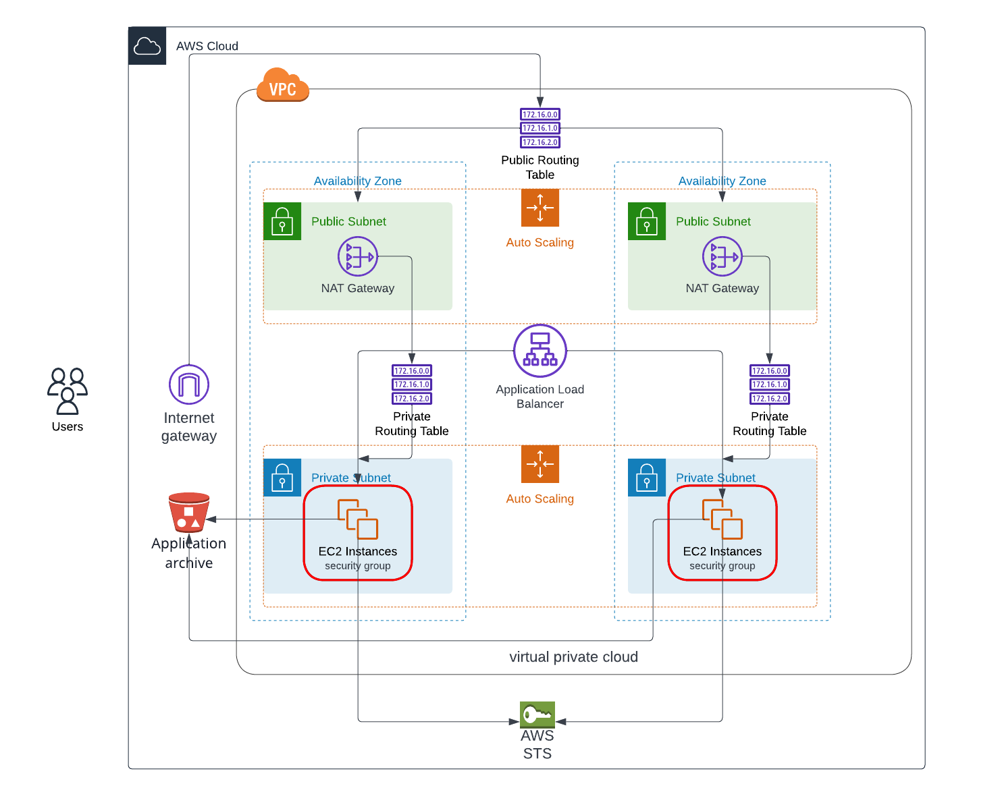

### High-availability web app using CloudFormation

This project Contains a **Cloud Formation Launch Configuration** for any application servers in order to deploy four servers, two located in each private subnets.
The launch configuration is used by an auto-scaling group.

#### Architecture

The following sections describe the individual components of the architecture.



This template creates the following diagram.

#### Deployment

Create stacks

```sh
bash create.sh network-stack network.yaml network-params.json

bash create.sh roles-stack roles.yaml roles-params.json

bash create.sh servers-stack servers.yaml servers-params.json
```

Update stacks

```sh
bash update.sh network-stack network.yaml network-params.json

bash update.sh roles-stack roles.yaml roles-params.json

bash update.sh servers-stack servers.yaml servers-params.json
```
